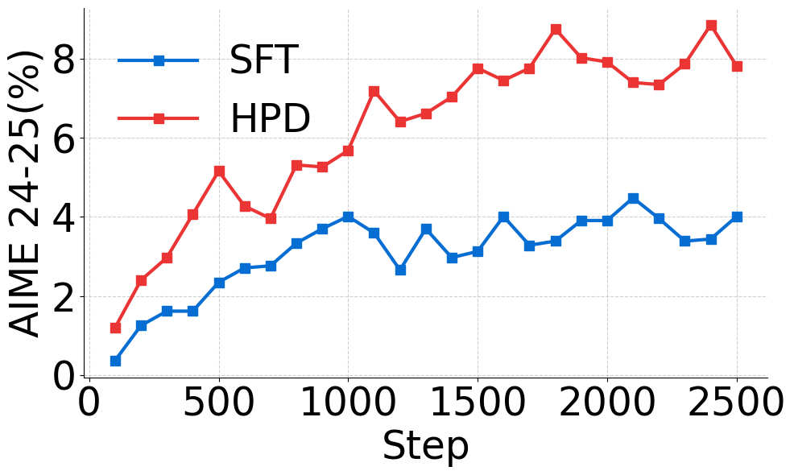
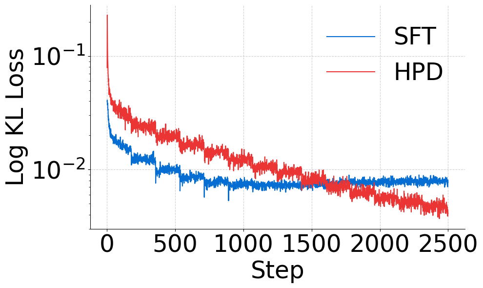
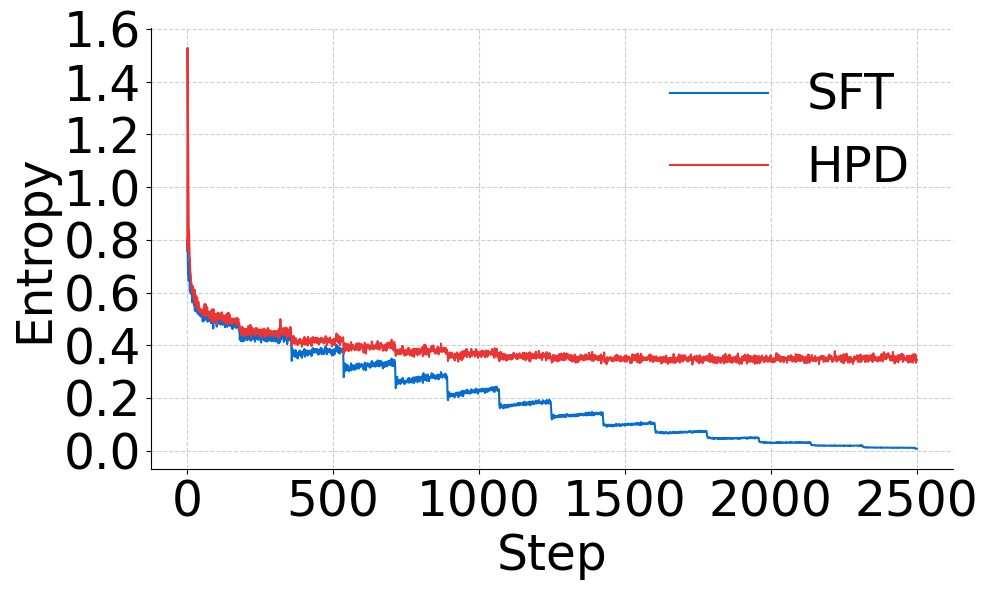
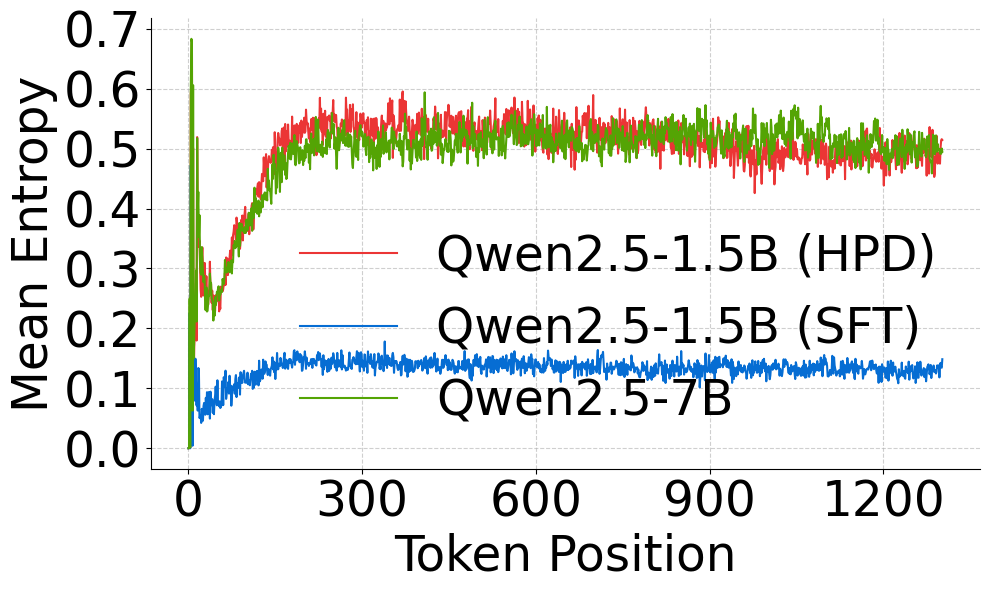

<div align="center">
<h1>Hybrid Policy Distillation</h1>

[ <u>Paper</u>](https://arxiv.org/abs/2508.17784) |
[ <u>Code</u>](https://github.com/zwhong714/Hybrid-Policy-Distillation) |
[ <u>Models</u>](https://huggingface.co/collections/wh-zhu/psft-68afb02eb237149f9bd9075e)
</div>

Hybrid Policy Distillation (HPD) is a practical distillation framework for reasoning-oriented language models. This repository contains the code, configurations, and experiment assets for the project. If HPD is useful for your research or production work, please consider starring the repository and citing the paper.

## 🎯 Overview

HPD is designed to make policy distillation more stable and efficient in post-training settings. The current release focuses on:

- 🧭 A unified view of policy distillation methods
- ⚡ Efficient one-hot-style distillation
- 🧩 A hybrid KL objective with a masking mechanism
- 🪶 Lightweight sampling under an offline-prefix setting

## 🗺️ Roadmap

- Release a reproducible Docker image
- Extend HPD to mid-training settings

## 📊 Results

We currently provide a Qwen2.5-1.5B student distilled from Qwen2.5-7B-Thinking with HPD. The released models are available from the Hugging Face collection linked above.

### 🏆 Benchmark Performance

| Model | AIME24 | AIME25 | AMC | MATH | OlympiadMath | GPQA |
| --- | ---: | ---: | ---: | ---: | ---: | ---: |
| Qwen2.5-7B-Thinking (Teacher, `wh-zhu/Qwen2.5-7B-PSFT-RL-DAPO-90`) | 28.13 | 27.19 | 71.72 | 87.48 | 58.50 | 43.43 |
| Qwen2.5-1.5B-Thinking (Student, `wh-zhu/qwen2.5-1.5B-longcot-reasoning-HPD`) | 13.75 | 18.13 | 54.14 | 76.30 | 45.33 | 31.31 |

### 📈 Training Dynamics

Representative training curves are shown below:

<p align="center">
  
  
</p>
<p align="center">
  
  
</p>

## 🛠️ Implementations

This repository currently provides two implementations:

| Implementation | Location | Training Regime | Entry Point | Notes |
| --- | --- | --- | --- | --- |
| LlamaFactory | `LlamaFactory/` | SFT with HPD loss | `llamafactory-cli train ...` | Supports both full fine-tuning and LoRA |
| verl | `verl/recipe/HPD/` | RL-style / post-training recipe | `bash recipe/HPD/run_hpd.sh` | Current recipe targets `fsdp` / `fsdp2` |

<details>
<summary>🔍 Key files</summary>

### 🦙 LlamaFactory

The LlamaFactory implementation integrates HPD directly into the SFT workflow.

- `LlamaFactory/src/llamafactory/train/hpd.py`: HPD loss implementation
- `LlamaFactory/src/llamafactory/train/sft/trainer.py`: trainer-side HPD integration
- `LlamaFactory/src/llamafactory/hparams/finetuning_args.py`: HPD-related arguments such as `use_hpd_loss`
- `LlamaFactory/examples/train_full/qwen3_full_hpd.yaml`: full-parameter HPD example config
- `LlamaFactory/tests/train/test_sft_trainer.py`: regression test covering HPD loss logging

### ⚙️ verl

The `verl` implementation keeps HPD as a recipe-local extension instead of patching the core PPO workers.

- `verl/recipe/HPD/main_hpd.py`: recipe entry point
- `verl/recipe/HPD/hpd_trainer.py`: HPD trainer built on top of `RayPPOTrainer`
- `verl/recipe/HPD/dp_actor.py`: HPD actor logic
- `verl/recipe/HPD/fsdp_workers.py`: FSDP worker integration
- `verl/recipe/HPD/config/hpd_trainer.yaml`: base Hydra config
- `verl/recipe/HPD/run_hpd.sh`: runnable experiment script

</details>

## 📦 Installation

### 🦙 LlamaFactory Backend

Run the following inside `LlamaFactory/`:

```bash
cd LlamaFactory
pip install -e .
pip install -r requirements/metrics.txt
```

If you plan to run full-parameter HPD with DeepSpeed:

```bash
pip install -r requirements/deepspeed.txt
```

For more environment details, see [LlamaFactory/README.md](LlamaFactory/README.md).

### ⚙️ verl Backend

Run the following inside `verl/`:

```bash
cd verl
pip install -e .
```

Depending on your backend, you may also need optional dependencies such as `vllm`, `flash-attn`, or math-evaluation packages. For backend-specific environment setup, see [verl/README.md](verl/README.md).

## 🚀 Usage

### 🦙 LlamaFactory: Full-Parameter HPD

```bash
cd LlamaFactory
llamafactory-cli train examples/train_full/qwen3_full_hpd.yaml
```

This example uses:

- `stage: sft`
- `finetuning_type: full`
- `use_hpd_loss: true`

If `ref_model` is not set, full-parameter HPD uses a frozen copy of `model_name_or_path` as the teacher model.

To use an external teacher, set:

```yaml
ref_model: path_or_hf_repo_of_teacher
ref_model_adapters: path_to_teacher_adapter
ref_model_quantization_bit: 4
```

### 🎛️ LlamaFactory: LoRA HPD

LoRA is also supported, but unlike full fine-tuning, LoRA HPD requires an explicit teacher:

```bash
cd LlamaFactory
llamafactory-cli train examples/train_lora/qwen3_lora_sft.yaml \
    use_hpd_loss=true \
    ref_model=Qwen/Qwen3-4B-Instruct-2507 \
    output_dir=saves/qwen3-4b/lora/hpd
```

### 📝 LlamaFactory Notes

- `use_hpd_loss` is only valid for `stage: sft`
- LoRA HPD requires `ref_model`; full-parameter HPD does not
- Full-parameter HPD keeps both student and teacher in memory, so GPU memory usage is much higher than standard SFT
- The provided full example uses DeepSpeed ZeRO-3 by default for that reason
- If you only want to test the pipeline, reduce `max_samples`, `cutoff_len`, and batch size first

### ⚙️ verl: Quick Start

```bash
cd verl
bash recipe/HPD/run_hpd.sh
```

Before launching the provided script, update the local paths in `recipe/HPD/run_hpd.sh` to match your environment, especially:

- `MODEL_PATH`
- `REF_MODEL_PATH`
- `TRAIN_FILE`
- Evaluation parquet files
- `CKPTS_DIR`

The current recipe uses Hydra configs under `verl/recipe/HPD/config/` and is set up for FSDP-based training.

## 📚 Citation

If you use this repository or the HPD idea in your work, please cite the paper linked above.
